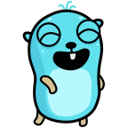
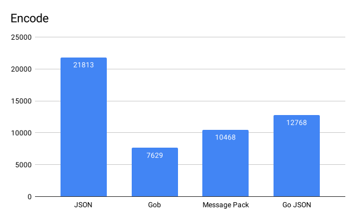
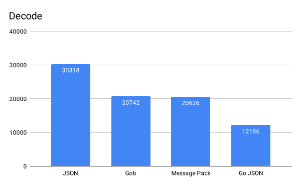

<div align="center">


&nbsp;

[](http://golang.org)
[](https://pkg.go.dev/github.com/ainsleyclark/redigo)
[](https://github.com/ainsleyclark/redigo/actions/workflows/test.yml)
[](https://codecov.io/gh/ainsleyclark/redigo)
[](https://goreportcard.com/report/github.com/ainsleyclark/redigo)

</div>

# RediGo

A Redis client for GoLang featuring Tags with Gob &amp; JSON encoding.

## Install

```
go get -u github.com/ainsleyclark/redigo
```

## Quick Start

See below for a quick start to create a new Redis Client with an encoder. For more client methods see the
[Go Doc](https://pkg.go.dev/github.com/ainsleyclark/redigo) which includes all the client methods.

```go
func ExampleClient() {
	ctx := context.Background()

	c := redigo.New(&redis.Options{}, redigo.NewGobEncoder())
	err := c.Ping(ctx)
	if err != nil {
		log.Fatalln(err)
	}

	err = c.Set(ctx, "my-key", "hello", redigo.Options{
		Expiration: time.Second * 100,
		Tags:       []string{"my-tag"},
	})
	if err != nil {
		log.Fatalln(err)
	}

	var val string
	err = c.Get(ctx, "my-key", &val)
	if err != nil {
		log.Fatalln(err)
	}

	err = c.Delete(ctx, "my-key")
	if err != nil {
		log.Fatalln(err)
	}
}

```

## Encoders

### JSON

```go
c := redigo.New(&redis.Options{}, redigo.NewJSONEncoder())
```

### Gob

```go
c := redigo.New(&redis.Options{}, redigo.NewGobEncoder())
```

### Message Pack
See [github.com/vmihailenco/msgpack](https://github.com/vmihailenco/msgpack) for more details.

```go
c := redigo.New(&redis.Options{}, redigo.NewMessagePackEncoder())
```

### Go JSON
See [github.com/goccy/go-json](https://github.com/goccy/go-json) for more details.

```go
c := redigo.New(&redis.Options{}, redigo.NewMessagePackEncoder())
```

### Custom
You can pass in custom encoders to the client constructor, that implement the Encode and Decode methods.

```go
type MyEncoder struct{}

func (m MessagePack) Encode(value any) ([]byte, error) {
	// Marshal or encode value
	return []byte("hello"), nil
}

func (m MessagePack) Decode(data []byte, value any) error {
	// Unmarshal or decode value
	return nil
}

func ExampleCustom() {
	c := redigo.New(&redis.Options{}, &MyEncoder{})
}
```

### Benchmarks

```bash
$ go version
go version go1.18.2 darwin/amd64
```

### Encode

```bash
BenchmarkEncode/JSON-16                    54513             21684 ns/op            9294 B/op        206 allocs/op
BenchmarkEncode/Gob-16                    156678              7641 ns/op            4304 B/op        220 allocs/op
BenchmarkEncode/Message_Pack-16           116875             10334 ns/op            6820 B/op        208 allocs/op
BenchmarkEncode/Go_JSON-16                115938             10300 ns/op            6820 B/op        208 allocs/op
```

#### Graph representing ns/op.


### Decode

```bash
BenchmarkDecode/JSON/-16                   39798             30011 ns/op            7243 B/op        302 allocs/op
BenchmarkDecode/Gob/-16                    58815             20958 ns/op           12734 B/op        193 allocs/op
BenchmarkDecode/Message_Pack/-16           56742             21574 ns/op            7217 B/op        220 allocs/op
BenchmarkDecode/Go_JSON/-16                58614             21888 ns/op            7218 B/op        220 allocs/op
```

#### Graph representing ns/op.


## Credits
Shout out to the incredible [Maria Letta](https://github.com/MariaLetta) for her excellent Gopher illustrations
